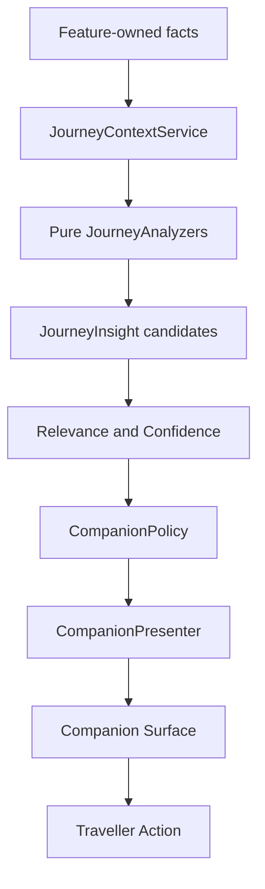

# ITAREVO Journey Intelligence & Companion Architecture

## Purpose and Non-Goals

This document is the authoritative architecture and product specification for ITAREVO Journey Intelligence and Companion behavior. It defines future contracts; it does not implement them.

The governing product relationship is:

> Intelligence defines what ITAREVO does. The companion relationship defines how ITAREVO behaves. The visual identity defines how ITAREVO feels.

ITAREVO must never present a claim as fact without evidence. It does not become intelligent by sounding certain, conversational, or proactive. It becomes useful by selecting the right supported context at the right moment, then offering a real action.

This specification does not authorize changes to Flutter feature behavior, models, storage, routing, Maps, Firebase, Cloud Run, Translator, authentication, currency logic, or packages. It introduces no AI or LLM API.

The companion must follow [the Visual Identity Blueprint](ITAREVO_VISUAL_IDENTITY.md): calm, concise, evidence-based, non-anthropomorphic, and visually related to the Journey Line rather than a chatbot.

## 1. Existing Intelligence Baseline

### What ITAREVO Knows Today

| Domain | Confirmed data | Current owner |
| --- | --- | --- |
| Trip | destination, departure/return dates, traveller count, notes, budget, currency | `Trip`, trip storage, Trips feature |
| Itinerary | title, date, optional time, location, category, notes, optional estimated cost, currency, booking flag, optional coordinates, optional stored travel minutes, optional `orderIndex` | `ItineraryItem`, itinerary storage, Itinerary feature |
| Order | day grouping; date ordering; complete per-day `orderIndex` precedence; otherwise time then original position | `orderItineraryItems` |
| Overview | trip status, duration, countdown, plan/booked/mapped counts, estimated cost, budget progress/overage, next scheduled plan | `TripOverviewService` |
| Route | optional route duration, distance, and polyline points for valid coordinate pairs | `RouteService`, map/itinerary screens |
| Map | valid itinerary coordinates, ordered markers and adjacent-day-safe route pairs | `TripMapProjection`, `TripMapScreen` |
| Nearby | category results around a supplied trip coordinate or permission-based current device position while Nearby is active | Nearby feature |
| Language | selected app locale, selected translator source/target language, translation availability/error state | localization and Translator feature |

### What ITAREVO Can Derive Deterministically Today

- Whether a trip is upcoming, in progress, or completed from date boundaries.
- The next scheduled itinerary item when date/time ordering is present.
- Today's or a selected day's ordered items.
- Missing itinerary coordinates, mapped count, booking count, and known estimated costs.
- Known budget progress and over-budget amount when a budget and estimated costs exist.
- Adjacent same-day route pairs with valid coordinates.
- Known route duration and distance only after a route result is returned.
- An optimization proposal for three or more mapped stops; it preserves unmapped positions and activity times.
- A deterministic fallback ordering cost for optimizer internals when a route lookup fails. This is not a live route duration and must not be presented as one.

### Existing Engines and Presentation Boundaries

- `TripOverviewService` is a pure summary/next-plan derivation service.
- `ItineraryOptimizer` is a deterministic route-ordering service, not a general recommendation engine.
- `AppJourneyBrief`, `AppAttentionCard`, and `AppJourneyConnector` render supplied data. They must not become analyzers or decision engines.
- Route loading remains owned by itinerary/map features; the future intelligence layer consumes normalized route facts, never triggers hidden route requests.

### What ITAREVO Does Not Know Today

ITAREVO has no authoritative evidence for actual reservations, payments, activity completion, device location outside Nearby, traveller proximity to a stop, weather, traffic, transport disruptions, opening hours, flight status, venue availability, personal preferences, accessibility needs, dietary needs, trip pace, or recommendations. It also has no live exchange rates, spending ledger, or destination-language source of truth.

## 2. Conceptual JourneyContext

`JourneyContext` is a future immutable snapshot assembled from feature-owned data. It is not yet a Dart model and must not replace existing models or storage.

| Context field | Classification | Notes |
| --- | --- | --- |
| destination, dates, travellers, trip budget/currency | Available now | Structured `Trip` data |
| trip status and duration | Derivable now | From trip dates and supplied clock |
| current local time | Available at runtime | Must carry timezone/source metadata; device time alone is not destination time |
| trip-relative day/time | Derivable now | Only from an explicit supplied clock and trip dates |
| next scheduled item | Derivable now | High confidence only when ordering/date/time evidence supports it |
| today's/upcoming itinerary items | Derivable now | From ordered itinerary and supplied clock |
| past item or day completion | Unsafe to infer | A past time is not proof the activity occurred |
| itinerary gaps/free time | Derivable now, but inferred presentation | Requires an explicit conservative rule and time-bearing neighboring items |
| missing coordinates, missing time, missing cost | Derivable now | Absence of an optional field, not an error by default |
| valid itinerary coordinates | Available now | Stored place coordinates only |
| device location | Future permission-based capability | Nearby currently obtains location feature-locally; no background/context tracking exists |
| distance from traveller to stop | Future | Requires permission, current location freshness, and explicit consent |
| route duration/distance | Available when loaded | Must retain result timestamp, travel mode, and provider availability |
| long transfer | Derivable when route data exists | Threshold must be explicit, configurable, and contextual |
| booking flag | Available now | Boolean planning flag only, not reservation confirmation |
| reservation/provider status | Future | Requires an authoritative provider or user-confirmed record |
| known estimated costs, budget, currency | Available now | Estimated, not actual expenditure |
| budget progress/overage | Derivable now | Only from known estimated costs and budget; unknown costs stay unknown |
| app locale and translation selection | Available now | Locale is not proof of traveller language or destination language |
| destination language | Future | Requires a trusted destination-language source and a defined policy |
| weather, traffic, opening hours, transport status | Future | External authoritative providers, freshness, failure policy required |
| preferences: pace, interests, access, food, budget style | Future | Explicit consent and user-controlled preferences only |

### Context Rules

1. Context records raw facts and derivations separately.
2. Every context field has source, observed/derived timestamp, availability, and confidence metadata.
3. Optional or missing data is represented as unavailable, never fabricated defaults.
4. An analyzer must receive only the fields it needs; it must not reach into feature storage or widgets.
5. Context construction must not cause hidden navigation, writes, route calls, permission prompts, or network requests.

## 3. JourneyState

`JourneyState` is a conservative state classification for companion policy. Multiple candidate states may be possible; the policy chooses the most supported one.

| State | Required evidence | Confidence | Available today | Companion behavior |
| --- | --- | --- | --- | --- |
| `NO_ACTIVE_TRIP` | No selected trip context | Confirmed | Yes | Silent; offer existing trip creation/browsing only in context |
| `PLANNING` | Trip exists and current date is before departure | Confirmed | Yes | Helpful: surface plan completeness or next planned item |
| `UPCOMING` | Trip exists before departure, especially near departure | Confirmed date relation | Yes | Helpful, never urgent solely from proximity |
| `TRAVEL_DAY` | Current date falls within trip dates | Confirmed date relation | Yes | Helpful: today's ordered plan and known route context |
| `ACTIVE_TRIP` | Current date falls within inclusive trip range | Confirmed | Yes | Silent/helpful depending on an actionable insight |
| `BETWEEN_ACTIVITIES` | Two reliable timed items bracket current time | High | Partially | Helpful only; do not claim physical downtime or completion |
| `ACTIVITY_APPROACHING` | Next timed item is within a defined window and clock/timezone is reliable | High | Partially | Helpful; proactive only under later policy with meaningful action |
| `DAY_COMPLETE` | User confirmation or trusted completion data | Confirmed | No | Future only; never infer from clock alone |
| `TRIP_COMPLETE` | Current date after return date | Confirmed date relation | Yes | Silent or helpful summary; do not claim journey experiences completed |

State is not location tracking. `TRAVEL_DAY`, `ACTIVE_TRIP`, and `ACTIVITY_APPROACHING` describe calendar/schedule context, not where the traveller physically is.

## 4. Unified JourneyInsight

A future `JourneyInsight` is the normalized result of one analyzer. It is structured data, not prewritten prose and not an instruction to display.

| Field | Purpose |
| --- | --- |
| `id` | Stable, deduplicable identifier based on analyzer, subject, and version |
| `type` | `INFORMATION`, `OPPORTUNITY`, `REMINDER`, `ATTENTION`, `DISRUPTION`, or `SAFETY` |
| `messageKey` and arguments | Localized communication contract; user-entered values remain untouched |
| `supportingData` | Typed evidence needed for detail/audit/action rendering |
| `severity` | `LOW`, `NORMAL`, `HIGH`, `CRITICAL`; not synonymous with relevance |
| `relevance` | Policy output used for ranking, not a public truth claim |
| `confidence` | `CONFIRMED`, `HIGH`, `INFERRED`, or `UNKNOWN` |
| `source` | Analyzer name and underlying context/provider sources |
| `observedAt` / `freshUntil` | Freshness requirements; mandatory for external/live facts |
| `actions` | Existing, capability-gated `JourneyAction` values |
| `dismissibility` | Whether and how a traveller can suppress the insight |
| `expiry` | Time or state condition after which it must disappear |
| `proactiveEligible` | Candidate flag; policy may still deny presentation |

`DISRUPTION` and `SAFETY` categories are reserved for future authoritative providers. They cannot be generated by schedule guesses, absent coordinates, or an LLM.

## 5. Confidence and Evidence

| Confidence | Meaning | Permitted language |
| --- | --- | --- |
| `CONFIRMED` | Direct structured or authoritative source fact | “Your itinerary contains 4 stops.” |
| `HIGH` | Deterministic derivation from complete, valid facts | “Coming up · Uffizi Gallery · 10:30.” |
| `INFERRED` | Conservative rule with meaningful uncertainty | “There appears to be time between these scheduled stops.” |
| `UNKNOWN` | Evidence is absent, stale, conflicting, or insufficient | Never present as a factual insight |

### Evidence Rules

- A booking flag means an item is marked booked in ITAREVO. It does not mean a reservation is confirmed.
- Stored coordinates mean a stop has coordinates. They do not mean the traveller is there.
- A returned route duration is known only for its origin, destination, mode, and freshness; it is not a live ETA or traffic claim.
- A past itinerary time does not prove completion or attendance.
- An absent time, coordinate, or cost is a planning gap, not a failure, unless a defined actionable rule says otherwise.
- External facts require source identity, freshness, and failure behavior. Stale facts must be labeled, downgraded, or suppressed.
- Generative output may never invent source facts, evidence, actions, reservations, environmental conditions, or urgency.

## 6. Relevance Engine

The relevance engine decides which valid insights deserve attention. A technically interesting fact is not automatically useful.

A conceptual ranking uses bounded factors rather than premature mathematical precision:

$$R = C \times A \times T \times K + N - D$$

where $C$ is confidence, $A$ actionability, $T$ temporal proximity, $K$ consequence, $N$ novelty, and $D$ repetition/dismissal penalty. Urgency and disruption severity may raise $K$ only with authoritative evidence.

Relevance scoring is subordinate to policy gates. A score must never override insufficient evidence, `UNKNOWN` confidence, stale data, unavailable capabilities, denied permissions, active dismissal/cooldown, or user controls. Eligibility and suppression are evaluated before ranking.

### Ranking Policy

- High confidence and a useful action outrank novelty.
- A low-confidence insight cannot outrank a confirmed one merely because it is near in time.
- An actionless item is usually silent unless it is confirmed, materially consequential, and safely informational.
- Related insights should bundle by trip, day, and subject.
- A dismissed insight receives a strong repetition penalty until its evidence changes materially.
- The engine returns ranked candidates; it does not decide visual mode or notification delivery.

## 7. Companion Modes

### Silent

The companion is available through coherent hierarchy and the Journey Line but creates no additional surface. Use when no insight is actionable, confidence is weak, the traveller has dismissed related content, or the screen already exposes the fact clearly.

### Helpful

The companion may render an in-app structured surface when an insight is relevant, supported, and tied to an existing action or clear context. This is the default mode for deterministic intelligence.

### Proactive

Proactive presentation is exceptional. A candidate requires all of:

1. `CONFIRMED` or `HIGH` confidence;
2. meaningful consequence if ignored;
3. time relevance or a material state change;
4. a clear, currently available action;
5. no active dismissal/cooldown; and
6. an explicitly enabled delivery channel and user permission where applicable.

Marketing, generic recommendations, unbooked optional items, and speculative schedule gaps are never proactive by default. Future critical safety/disruption events may override normal limits only when authoritative data and a documented escalation policy exist.

## 8. Interruption Budget

The companion becomes quieter as confidence or relevance falls.

- Deduplicate by stable insight ID and semantic subject.
- Bundle related issues: one day-level missing-data summary, not one interruption per stop.
- Apply cooldowns after display and longer cooldowns after dismissal.
- Remember dismissal by insight version; a material evidence change may re-enable it.
- Enforce a maximum of one low-priority helpful surface per primary screen context and no low-priority proactive intervention by default.
- Respect quiet periods and user controls for future proactive channels.
- Escalate only when confidence, consequence, freshness, and actionability materially increase.
- Expire route, environmental, and provider insights by freshness rules; never revive stale alerts.

## 9. JourneyAction Contract

Actions are capability-gated routes to existing product behavior. An insight must not expose an action that is unavailable.

| Action | Available now | Contract |
| --- | --- | --- |
| `OPEN_ITINERARY` | Yes | Open current trip itinerary |
| `OPEN_MAP` | Yes | Open existing trip map for known items |
| `OPEN_TRANSLATOR` | Yes | Open Translator, without inventing a phrase or destination language |
| `OPEN_TRIP` | Yes | Open existing trip overview |
| `REVIEW_STOP` | Yes | Open existing stop detail/edit entry point |
| `EDIT_STOP` | Yes | Open existing itinerary edit path |
| `REORDER` | Limited | Open existing optimization review only when optimizer has valid candidate conditions |
| `VIEW_ROUTE` | Limited | Open route/map context only when known coordinates/route behavior supports it |
| `TRANSLATE` | Yes | Open existing Translator |
| `FUTURE_BOOK` | No | Hidden until booking capability exists |
| `FUTURE_NAVIGATE` | No | Hidden until an approved navigation capability exists |
| `FUTURE_CONTACT_PROVIDER` | No | Hidden until authoritative provider data exists |

The presenter maps an action to feature navigation. An analyzer emits an action type only; it does not import screen classes or mutate data.

## 10. Companion Communication

The voice is calm, concise, observant, warm, and internationally appropriate. It is never childish, overenthusiastic, or conversational for its own sake.

| Form | Target | Rule |
| --- | --- | --- |
| Glance | 1 line | Status + subject, e.g. “Coming up · Uffizi Gallery · 10:30” |
| Brief | 1–2 lines | Fact, consequence, and available action |
| Detail | Short expandable explanation | Evidence, freshness, and one or two real actions |

Prefer direct labels, concrete numbers, and localized message keys. Avoid filler such as “Great news,” emojis, apologies without remedy, or claims such as “I noticed” when no monitoring occurred. User-entered titles, locations, notes, and mixed-direction text are displayed unchanged.

## 11. Companion Surface Contract

The UI renders a decision; the UI does not decide what is intelligent.

The Companion Surface receives a presentational view model containing localized message key/arguments, visual severity, freshness, optional action labels, and accessibility semantics. It does not read storage, calculate rules, request location, call routes, or infer confidence.

Its future visual signature follows the Visual Identity Blueprint: quiet, line-related, precise, and recognizably ITAREVO rather than a generic card or chatbot bubble.

## 12. Deterministic-First Intelligence Ladder

1. **Level 1: Deterministic intelligence.** Trusted structured trip, itinerary, route, locale, and known financial data. This is the first implementation target.
2. **Level 2: External real-time intelligence.** Weather, traffic, opening hours, transport, reservation, and disruption providers. Each requires authority, consent where relevant, freshness, caching, and failure contracts.
3. **Level 3: Preference and personal intelligence.** Explicitly supplied preferences and transparent adaptation. No covert profiling.
4. **Level 4: Generative intelligence.** Natural-language explanation, planning assistance, and conversation over trusted context.

LLMs are never the source of truth for deterministic journey facts. Later generative systems may explain trusted context but must cite their structured basis internally, preserve uncertainty, and remain incapable of fabricating state.

## 13. Intelligence Examples

| Input context | Insight | Confidence | Priority/mode | Action | Availability |
| --- | --- | --- | --- | --- | --- |
| Ordered itinerary has 4 items | “4 stops planned.” | Confirmed | Low / Helpful | `OPEN_ITINERARY` | Now |
| First ordered item has valid time | “First stop · Uffizi Gallery · 10:30.” | High | Normal / Helpful | `REVIEW_STOP` | Now |
| Item lacks coordinates | “1 location needs coordinates.” | Confirmed | Normal / Helpful | `EDIT_STOP` or `OPEN_MAP` | Now |
| Day has 3+ mapped items | “A route order review is available.” | Confirmed | Normal / Helpful | `REORDER` | Now |
| Route result exists between stops | “18 min · 1.4 km to next stop.” | Confirmed for returned route result | Low / Silent or Helpful | `VIEW_ROUTE` | Now |
| Route result is absent | No route claim; optional quiet “Route unavailable.” | Confirmed absence | Low / Silent | `OPEN_MAP` only if useful | Now |
| Stored `travelMinutesToNext` exists | “15 min planned transfer.” | Confirmed stored plan value | Low / Helpful | `OPEN_ITINERARY` | Now |
| Known estimated costs exceed trip budget | “Known estimates exceed budget by EUR 120.” | High | Normal / Helpful | `OPEN_TRIP` | Now |
| Budget exists but no estimated costs | No budget-progress insight | Unknown | Silent | None | Now |
| Item marked booked | “Marked booked.” | Confirmed flag only | Low / Silent | `REVIEW_STOP` | Now |
| Unbooked item | “Not marked booked.” only when user seeks plan completeness | Confirmed flag | Low / Helpful | `EDIT_STOP` | Now |
| Two timed stops have a conservative gap | “Time between scheduled stops.” | Inferred | Low / Helpful | `OPEN_ITINERARY` | Future rule after review |
| Next scheduled item is within an explicit window | “Coming up · [title] · [time].” | High | Normal / Helpful | `REVIEW_STOP` | Future policy over current data |
| Trip begins in a defined date window | “Trip begins in 3 days.” | Confirmed | Low / Helpful | `OPEN_TRIP` | Future policy over current data |
| Current item time is past | No completion claim | Unknown | Silent | None | Now |
| Current location permission granted and fresh | “You are [distance] from next stop.” | High | Normal / Helpful | `FUTURE_NAVIGATE` | Future |
| Location permission denied | “Location is off” only in a location-dependent flow | Confirmed | Low / Helpful | Settings/action if implemented | Future |
| Authoritative weather forecast | “Rain expected before outdoor stop.” | High with freshness | Normal / Helpful | `REVIEW_STOP` | Future |
| Authoritative traffic/route provider | “Route is longer than the saved estimate.” | High with freshness | High / eligible Proactive | `FUTURE_NAVIGATE` | Future |
| Authoritative flight provider | “Flight delay confirmed by provider.” | Confirmed/high | High / eligible Proactive | `FUTURE_CONTACT_PROVIDER` | Future |
| Authoritative reservation data | “Reservation starts in 30 min.” | Confirmed/high | Normal / Helpful | `REVIEW_STOP` | Future |
| Translation screen available, traveller opens a language-relevant flow | Offer Translator entry, not a claimed language need | Confirmed capability | Low / Helpful | `OPEN_TRANSLATOR` | Now |
| Explicit accessibility preference conflicts with a provider fact | Contextual accessible alternative | High only with authoritative data | Normal / Helpful | Future action | Future |
| Repeated dismissed missing-coordinate insight | Suppress until the item changes | Confirmed dismissal record | Silent | None | Future policy |

## 14. Privacy and Trust

- Collect only context required for a traveller-visible benefit.
- Location intelligence is permission-based, scoped, fresh, and controllable; no background monitoring by implication.
- Explain why a future recommendation or proactive message appears when that explanation would help trust.
- Distinguish direct fact, deterministic derivation, and inference in data and language.
- Keep private journey data out of unnecessary surfaces, logs, analytics, and cross-trip context.
- Provide controls for future proactive assistance, location use, and preference retention.
- Do not simulate a human companion, hidden observation, empathy, or certainty.
- Do not use an LLM or third-party provider to upgrade weak evidence into a confident claim.

## 15. Failure and Degradation Behavior

Loss of AI must never break the itinerary. Loss of live context falls back to deterministic trip information.

| Failure | Required behavior |
| --- | --- |
| Route unavailable | Show no duration/distance fact; retain itinerary and map availability |
| Location permission denied | Keep trip-coordinate and itinerary features usable; explain only in location-dependent flow |
| Weather/provider unavailable | Suppress environmental insight; never retain stale weather as current |
| AI unavailable | Keep deterministic context, actions, and all core features functional |
| Network unavailable | Use persisted trip/itinerary information; label/omit externally dependent insights |
| Booking source stale | Suppress confirmation/disruption claim or clearly mark stale only when a supported UI policy exists |
| Invalid/missing itinerary data | Render existing item safely and present a bounded completeness action only when actionable |

## 16. Conservative Technical Architecture

No files are created by this specification. A future implementation should use narrow, testable layers:

| Layer | Responsibility | Dependencies |
| --- | --- | --- |
| `JourneyContextService` | Assemble immutable facts from existing feature-owned services and explicit clock/provider inputs | Trip/itinerary readers; no widgets |
| `JourneyAnalyzer` | Pure function from context to candidate insights | Context only; no storage/network/navigation |
| `JourneyInsight` | Typed, normalized candidate contract | Pure data |
| `JourneyRelevanceEngine` | Rank, deduplicate, bundle, and expire candidates | Insights + policy inputs |
| `CompanionPolicy` | Select Silent/Helpful/Proactive presentation based on confidence, interruption budget, and capabilities | Ranked insights + user controls |
| `JourneyAction` | Capability-gated action descriptor | Pure data |
| `CompanionPresenter` | Convert policy decision into localization/view-model contract | Localization and action registry, not business rules |
| External provider adapters | Isolate weather/traffic/booking/location/LLM boundaries later | Provider-specific; freshness and failure metadata mandatory |

Existing feature ownership remains intact: Trips own trips, itinerary screens/storage own itinerary CRUD, Maps own map rendering and route loading, Nearby owns device-location interactions, and Translator owns translation requests. There is no giant “AI service.”

## 17. Testing Strategy

Future implementation must add tests before widening capability:

- Unit tests for each deterministic analyzer and empty/partial context.
- Confidence/evidence tests proving unsupported claims are suppressed.
- Ordering, trip-status, route-availability, budget, and booking-flag regression tests.
- Relevance ranking, bundling, duplicate suppression, cooldown, dismissal, and expiry tests.
- Silent/Helpful/Proactive eligibility tests, including rejection of marketing and weak signals.
- Action mapping tests that prove only existing capabilities are exposed.
- Stale provider, offline, denied permission, and provider-failure degradation tests.
- Localization, long-text, CJK, Arabic/Persian RTL, and mixed-direction user-data tests.
- Widget tests proving companion surfaces render supplied decisions without computing business logic.
- Contract tests run without Firebase, Maps, Cloud Run, network, or an LLM wherever possible.

## 18. Phased Roadmap

| Phase | Scope | Exit criteria |
| --- | --- | --- |
| JI-1 | Immutable deterministic `JourneyContext`, normalized `JourneyInsight`, and pure analyzers for existing trip/itinerary/overview facts | Unit-tested without UI, network, Maps, or backend changes |
| JI-2 | Relevance engine, interruption budget, confidence policy, and capability-gated actions | Deterministic ranking/deduplication/action tests pass |
| JI-3 | Read-only CompanionPresenter integration in Home, Trip Overview, and itinerary using existing surfaces | UI renders policy output only; no feature behavior changes without explicit approval |
| JI-4 | Approved real-time provider adapters for weather, traffic, opening hours, booking, or transport | Each provider has authority, consent, freshness, privacy, offline, and failure contracts |
| JI-5 | Explicit preference and personalization layer | Consent, controls, explainability, and deletion behavior are tested |
| JI-6 | Generative companion assistance | Trusted-context grounding, refusal/suppression rules, evaluation, privacy review, and deterministic fallback are complete |

Every phase must be independently testable, reversible, and reviewable. A future phase may not introduce functionality implied by a later phase.

## Governance

Any new analyzer, provider, insight type, proactive channel, or companion action requires a design review against this document and the Visual Identity Blueprint. The review must name evidence, freshness, confidence, relevance, user control, failure behavior, localization impact, and the exact capability boundary. No intelligence feature is complete until it can fail quietly and truthfully.
