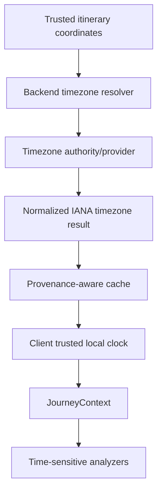

# ITAREVO Timezone Authority

## Status

Accepted architecture decision. This document defines a future timezone authority; it does not implement a provider, schema change, cache, backend endpoint, or runtime upcoming-activity behavior.

## Decision

**TIMEZONE IS EVIDENCE, NOT AN ASSUMPTION.**

A time-sensitive Journey Intelligence insight may render only when it has authoritative timezone evidence. ITAREVO must not derive authoritative trip-local time from destination text, app/device locale, language, currency, traveller nationality, phone timezone, or free-text location names.

Normal runtime upcoming-activity intelligence remains disabled until authoritative timezone evidence is available.

## Current Baseline

`Trip` stores destination text, dates, travellers, notes, budget, and currency. `ItineraryItem` stores a local calendar date, optional `HH:mm` string, optional location text, and optional coordinates. Neither model stores an IANA timezone identifier, UTC offset, or timezone provenance.

Maps, routes, Nearby, and existing Places-oriented bridges expose coordinates and place/address data, but no inspected result contains timezone information. Nearby may use a permission-based device position while that feature is open; this does not create trip-local time authority or permit continuous tracking.

`JourneyClock` currently has four sources:

| Source | Trusted for itinerary-local comparison? |
| --- | --- |
| `explicitTripLocal` | Yes |
| `testInjected` | Yes, for deterministic tests only |
| `deviceLocal` | No |
| `unknown` | No |

The runtime itinerary explicitly supplies `deviceLocal`; `JourneyContextBuilder` therefore suppresses `nextScheduledItem`. A past scheduled time never proves attendance or completion.

## Rejected Shortcuts

- Destination string is not timezone evidence: names can be ambiguous and a journey may visit several zones.
- Coordinates alone are evidence of place, not a timezone result, until resolved by an authoritative resolver.
- Locale, language, currency, nationality, and device timezone do not identify a stop timezone.
- Numeric UTC offsets alone are not durable authority. They fail across daylight saving, rule changes, and future dates.
- Device time must never silently become destination time after a provider failure.

## Options Considered

### Option A: Client Coordinate-to-Timezone Provider

Trusted itinerary coordinates are sent directly from Flutter to a resolver, which returns an IANA timezone identifier.

Strengths: direct, potentially low latency, supports stop-level and multi-zone journeys.

Risks: provider credentials can be exposed or difficult to restrict; client-side provider replacement, quotas, caching, privacy controls, observability, and error handling become fragmented. Offline behavior still requires a cache.

Recommended role: not the primary authority boundary.

### Option B: Persist Timezone Metadata on Trip or Itinerary Entities

Store a timezone ID directly on a trip and/or stop.

Strengths: deterministic client reads, offline reuse, explicit user visibility.

Risks: schema migration, provenance ambiguity, stale or manually incorrect values, edit semantics, and a single trip-level zone cannot represent London -> Dubai -> Tokyo. Direct persistence is valuable only after an authority has resolved the value.

Recommended role: a future normalized cache/projection, not the initial source of truth by itself.

### Option C: Backend-Authoritative Resolution and Caching

Trusted itinerary coordinates go to an ITAREVO backend boundary. The backend calls a selected timezone authority, normalizes a result, applies cache/freshness policy, and returns only the normalized result.

Strengths: server-side credential management, provider abstraction/replacement, centralized rate limiting, observability, privacy policy, normalized validation, and failure isolation.

Risks: backend latency and availability; offline clients still require safe cached data.

Recommended role: primary resolution authority.

## Recommended Hybrid

Use backend-authoritative coordinate-to-timezone resolution, normalized to an IANA identifier, then persist/cache the normalized result with provenance. The client consumes a validated result and builds `JourneyClock`; it does not resolve zones from text or call a provider directly.

This is preferable because it supports trust, multi-zone travel, provider replaceability, privacy controls, and offline-safe degradation.

## Multi-Timezone Strategy

A trip has no single authoritative timezone for every use case.

| Concept | Authoritative timezone |
| --- | --- |
| Itinerary stop | The stop's resolved IANA timezone ID |
| Travel segment | Origin and destination stop zones, each explicit |
| Day grouping | Traveller-entered local itinerary date for current behavior; future timezone-aware views must state their rule |
| “Coming up” | The next stop's resolved timezone and a clock explicitly comparable to it |
| Departure/arrival | Provider-supplied schedule timezone/instant when a future transport provider exists |
| Trip countdown | Explicit product rule; do not assume a trip-wide timezone for multi-zone travel |
| Current companion context | The contextually relevant next stop zone, when resolved and comparable |
| Device timezone | Device-only context, never substitute authority |

For London -> Dubai -> Tokyo or Los Angeles -> New York, stop-level timezone is authoritative. A future segment model may represent transitions, but no segment/schema change is made now.

## IANA Identifiers and DST

Store canonical identifiers such as `Europe/London`, `Asia/Tokyo`, and `America/New_York`, never only numeric offsets. A timezone ID plus the relevant itinerary date determines the applicable offset and supports daylight-saving rule changes.

Around DST transitions, a local itinerary time can be ambiguous or nonexistent. Future conversion must explicitly detect this. If a stop's local time cannot be interpreted safely, suppress the time-sensitive insight rather than selecting an arbitrary instant.

## Timezone Resolution Contract

A future immutable normalized contract may be:

| Field | Purpose |
| --- | --- |
| `timezoneId` | Canonical IANA ID when resolved |
| `status` | `resolved`, `unavailable`, `stale`, or `unknown` |
| `source` | Resolver/cache/manual future source, not provider raw payload |
| `resolvedAt` | Resolution time |
| `coordinateEvidence` | Coordinate provenance/precision used for resolution |
| `confidence` | Confirmed, high cached, or unknown |
| `freshness` | Policy-controlled validity metadata |

Provider raw responses must not leak into Journey Intelligence.

### Authority Rules

- **Confirmed:** authoritative IANA ID resolved from trusted stop coordinates.
- **High:** previously authoritative result whose coordinate provenance matches and whose configurable freshness policy allows reuse.
- **Unknown:** destination text only, device timezone only, missing coordinates, or provider failure without valid cache.

Relevance never upgrades timezone evidence. Unknown or stale-for-policy timezone evidence suppresses time-sensitive insight.

## Cache, Freshness, and Offline Behavior

Cache normalized IANA IDs, provenance, and result status; not only offsets. A cache key should include coordinates at a documented precision and relevant source/provenance. Precision must balance correctness, cache reuse, and privacy.

Timezone geography changes infrequently but legal rules can change. Freshness is policy/configurable rather than hard-coded here. Safe authoritative cached IDs may be reused when provenance matches; unresolved, mismatched, or stale-for-policy results are not silently replaced by device time.

Offline or provider failure behavior:

- itinerary, maps, routes, and CRUD remain functional;
- non-time-sensitive Journey Intelligence remains functional;
- trusted valid cache may be used under policy;
- otherwise time-sensitive insights remain silent.

## Privacy

Timezone resolution should use persisted, trusted itinerary coordinates where possible, not continuous live device location. Under a backend model, coordinates leave the device only for the resolver request according to disclosed privacy policy; Flutter does not receive provider credentials. Device position remains an independent permission-based Nearby feature and is not required for timezone authority.

## Migration

Do not alter current `Trip` or `ItineraryItem` schemas in the initial resolution phase. Prefer a separate timezone context/cache model keyed by stop/trip identity and coordinate provenance, with a future optional normalized projection if product needs warrant it.

Existing trips without timezone metadata remain valid. Unknown timezone is a legitimate state. A future migration must be backward-compatible and never make missing metadata imply device-local authority.

## International Date Line

Current itinerary ordering uses traveller-entered local date/time and must not be redesigned in this ADR. Future timezone-aware architecture must distinguish local itinerary wall time from a timezone-aware instant: calendar date ordering is not always elapsed UTC ordering across the International Date Line. Migration must preserve entered local values and add instant interpretation only when authority exists.

## Responsibilities

### Client

- consume normalized timezone results;
- create a trusted `JourneyClock` only when source/evidence permits it;
- retain cache only under approved policy;
- suppress unsafe time-sensitive insights.

### Backend

- own provider credentials and calls;
- normalize/validate IANA IDs;
- cache, rate-limit, observe, and isolate provider failures;
- support provider replacement without changing Journey Intelligence contracts.

Flutter must not expose provider credentials, choose a provider, or perform hidden timezone/geocoding inference.

## Provider Selection Later

A separate, current-verification task must evaluate coordinate-to-IANA support, geographic coverage, DST correctness, reliability, latency, quotas, pricing, terms, privacy, server-side authentication, cache permissions, SLA, and vendor lock-in. Any provider names discussed later are examples only until current terms and behavior are verified.

## Phased Delivery

1. **TZ-1:** timezone domain/result contract and fake resolver tests.
2. **TZ-2:** backend provider abstraction with fake implementation and normalization tests.
3. **TZ-3:** backend-authoritative resolver with security, observability, and rate limits.
4. **TZ-4:** provenance-aware cache/freshness and offline tests.
5. **TZ-5:** read-only client consumption and trusted `JourneyClock` construction.
6. **TZ-6:** enable runtime `NextScheduledItemAnalyzer` only for eligible resolved stop clocks.
7. **TZ-7:** multi-zone segment and travel-transition intelligence.

Each phase is independently testable and reversible.

## Capabilities Eventually Unlocked

Authoritative time can safely enable Coming up, day-transition awareness, time-to-next-plan, and morning/evening companion behavior. With separate authoritative providers it can later support opening-hours reasoning, transport departure context, booking check-in/check-out context, contextual translation timing, and disruption relevance windows. Timezone capability alone does not create any of those external facts.

## Decision Table

| Option | Trust | Multi-zone | Offline | Privacy/security | Complexity | Recommended role |
| --- | --- | --- | --- | --- | --- | --- |
| Client coordinate/provider | Medium | High | Cache required | Client exposure risk | Medium | Avoid as authority |
| Persisted metadata only | Variable | Medium | High | Good | Medium | Cache/projection only |
| Backend resolver | High | High | Backend dependent | Strong credential boundary | Medium-high | Primary authority |
| Hybrid | High | High | Safe cached fallback | Strong boundary | High | Recommended end state |

## Final Decision

Choose the hybrid architecture: **backend-authoritative timezone resolution from trusted itinerary coordinates, normalized to an IANA identifier, with provenance-aware safe caching/persistence.**

Rejected shortcuts: destination text, locale, currency, device timezone, coordinates without a resolver result, and fixed offsets as authority.

Safety invariants:

- timezone evidence is explicit, normalized, and attributable;
- unknown/stale-for-policy evidence suppresses time-sensitive intelligence;
- a past schedule never infers completion;
- no failure path silently substitutes device-local time.

First implementation phase is TZ-1, the domain contract and fake resolver tests.

**NORMAL RUNTIME UPCOMING-ACTIVITY INTELLIGENCE REMAINS DISABLED UNTIL AUTHORITATIVE TIMEZONE EVIDENCE IS AVAILABLE.**
